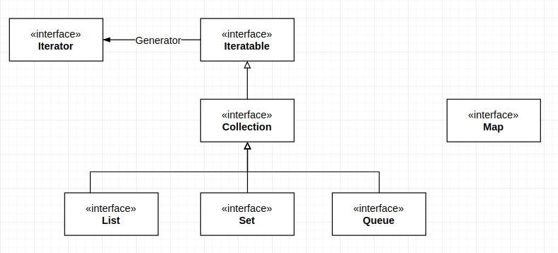

# Java Collection Framework(JCF)概览

JCF定义了两种基本容器: 集合(Collection)和映射(Map);
定义了容器中遍历元素的方法(Iterator).

## 集合

集合(Collection):

- List
- Set
- Queue

集合的属性:

- sorted/unsorted, 基于**元素的值**通过iterator**遍历**容器中的顺序是否固定
- ordered/unordered, 根据**元素存储**在容器中的**Index位置**的规则是否固定

## 视图

视图将源容器的数据聚合为一个**新的集合**, 集合中的元素为源容器中的元素而非拷贝; 
**视图的操作受限与源容器的操作, 对视图的操作会被传递给源容器**.

通过视图技术来获取视图对象:

- 轻量级集包装器
  + Arrays.asList
  + Collections的很多方法
- 子集视图
  + subList
  + subString
  + ...
- 不可修改视图, 对源集合增加运行时检查, 如果发现**视图对集合**进行修改, 抛出异常
  + Collections.unmodifiable*方法
- 同步视图, 使用视图机制来确保常规集合的线程安全(对源容器的串行化访问)
  + Collections.synchronized*
- 检查视图, 用来对源集合的泛型类型进行检查, 保证源集合中元素的类型一致性.
  + Collections.checked*

## Iterator

通过Iterator来逐个访问集合中的元素.

通过Iterable来获得Iterator, Collection扩展了Iterable.

元素的访问顺序取决于集合类型.

### 容器的批量操作

通过Set和子集视图来对源容器进行批量操作.

## Reference

- [Java Collections Framework Internals](https://github.com/CarpenterLee/JCFInternals)