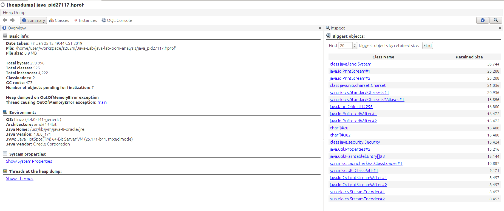
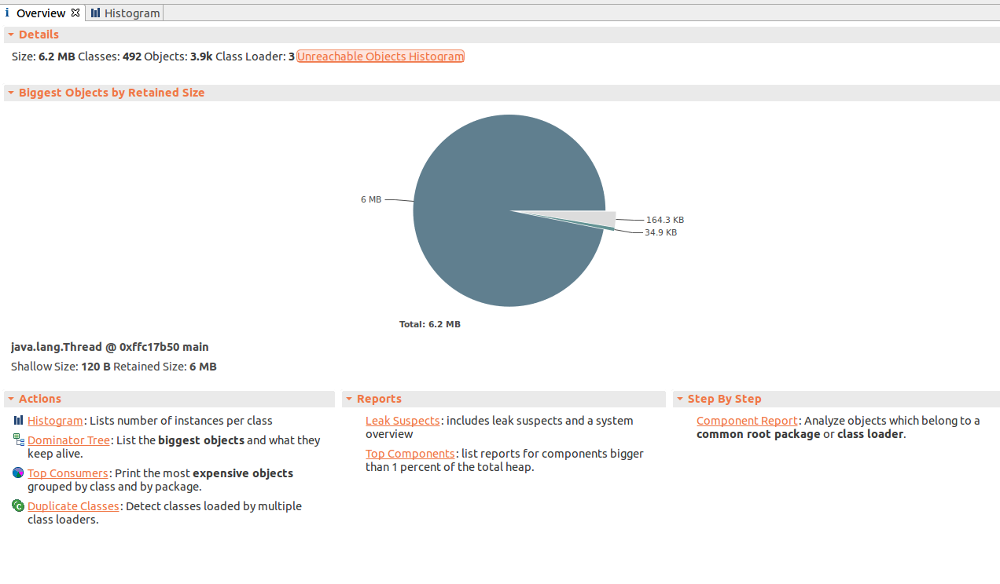

# 使用Java VirtualVM && MAT对OOM异常进行内存分析

## OOM产生的原因

详见[Understand the OutOfMemoryError Exception][]

通过`-XX:+HeapDumpOnOutOfMemoryError -XX:HeapDumpPath=.`命令可以在发生OOM(OutOfMemory)异常时,
将jvm的堆信息dump出来, 保存为**hprof文件**.

- shallow size, 实例自身占用的内存大小, 不包含其他实例的引用
- retained size, 实例自身+直接或间接引用的实例的shallow size, 是将要被GC回收的内存大小

## Java VirtualVM

导入hprof文件后, 如下图:

### Summary视图

- 系统以及jvm基本信息
- 发生OOM的线程信息
- 基于类的内存占用排行榜

### Class类视图

Class类视图包含所有类的实例数, 内存占用情况

可以通过排序来查看在OOM异常发生时的内存占用情况.

### Instances实例视图

Instances实例视图包含某个类的所有实例的信息, 以及内存占用情况.

## Eclipse Memory Analyzer Tool(MAT)

MAT的分析报告要比Java Virtual VM的信息更加全面.

### Overview视图

工具栏中可以打开**Heap Dump Overview**来查看基本汇总信息.

### Histogram视图

从类的角度, 查看所有类的实例以及内存占用信息.

右键选项**List Objects**:

- outgoing reference, 列出该实例引用了哪些实例, 可以查看该实例的组成
- incoming reference, 列出哪些实例引用了该实例, 可以调查调用栈

## Dominator Tree视图

从实例的角度, 包含所有实例的引用关系以及内存占用信息.

### Top Consumers视图

**Top Consumers**视图能够帮助快速定位内存占用最多的实例.

### Leak Suspects试图

列出发生内存泄漏最有可能的地方, 用于快速定位错误.

---

Understand the OutOfMemoryError Exception: https://docs.oracle.com/javase/8/docs/technotes/guides/troubleshoot/memleaks002.html
Java内存溢出(OOM)异常完全指南: https://www.jianshu.com/p/2fdee831ed03
使用 VisualVM 进行性能分析及调优: https://www.ibm.com/developerworks/cn/java/j-lo-visualvm/index.html
MAT使用进阶: https://www.jianshu.com/p/c8e0f8748ac0
Shallow heap & Retained heap: https://bjyzxxds.iteye.com/blog/1532937
MAT使用教程: https://blog.csdn.net/itomge/article/details/48719527
深入理解java中的Soft references && Weak references && Phantom reference: https://blog.csdn.net/xlinsist/article/details/57089288
